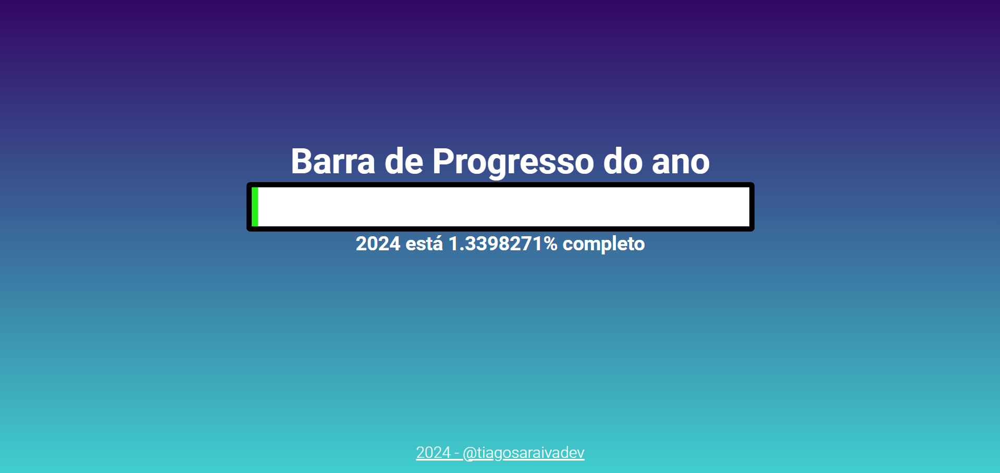

# Year Progress Bar

Uma ferramenta simples da barra de progresso do ano para visualizar a sua conclusão.

## Descrição

Este projeto consiste em uma barra de progresso que representa visualmente o progresso do ano atual. É uma maneira fácil e intuitiva de acompanhar quanto do ano já passou e quanto resta.

## Funcionalidades

- Barra de progresso interativa.
- Percentagem concluída exibida.
- Design minimalista e amigável.

## Como Usar

1. Baixe o projeto para o seu computador.
2. Abra o arquivo `index.html` no seu navegador web.

## Contribuição

Sinta-se à vontade para contribuir com novas funcionalidades, correções de bugs ou melhorias no design. Basta seguir estas etapas:

1. Faça um fork do repositório.
2. Crie uma branch para a sua contribuição: `git checkout -b feature/nova-feature`.
3. Faça suas alterações e faça commit: `git commit -m 'Adiciona nova feature'`.
4. Envie as alterações para o seu fork: `git push origin feature/nova-feature`.
5. Abra um pull request.

## Licença

Este projeto está licenciado sob a [Licença MIT](LICENSE).

## Contato

Se você tiver alguma dúvida ou sugestão, sinta-se à vontade para entrar em contato.

